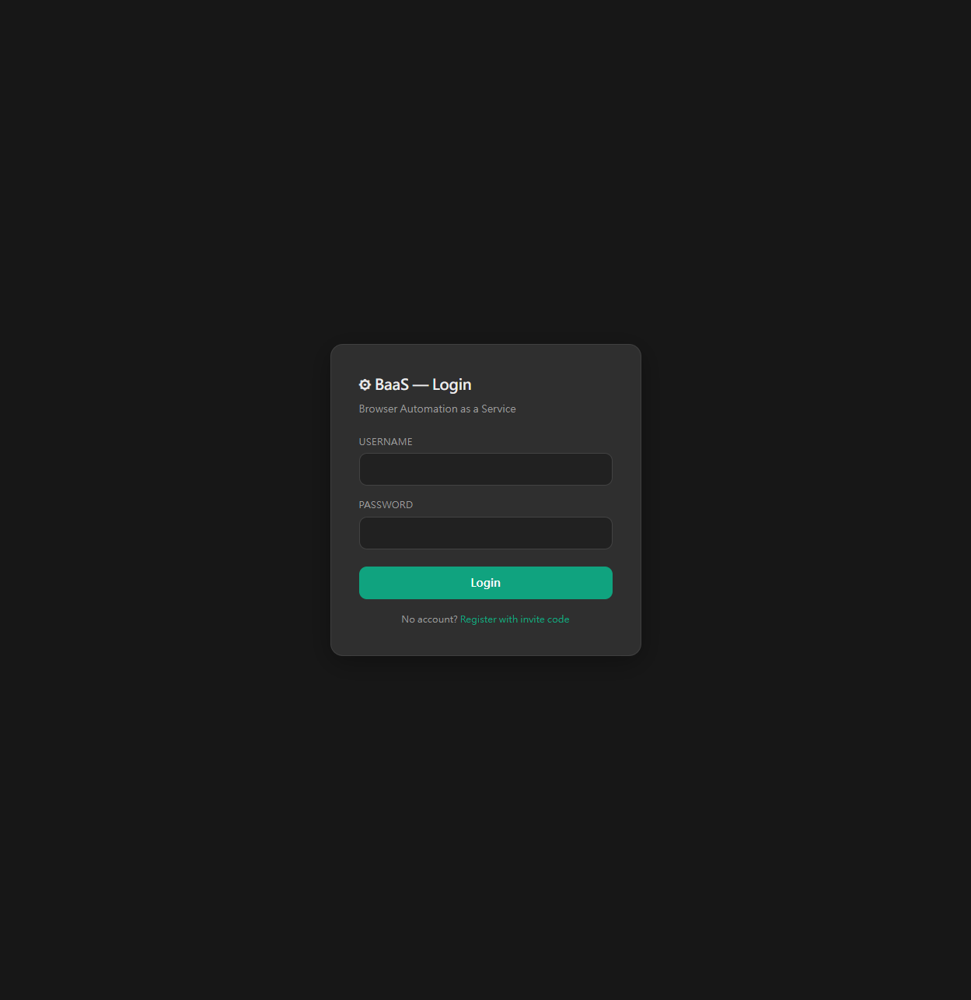
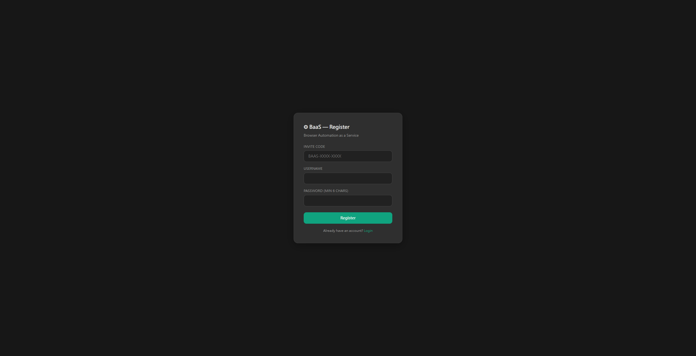
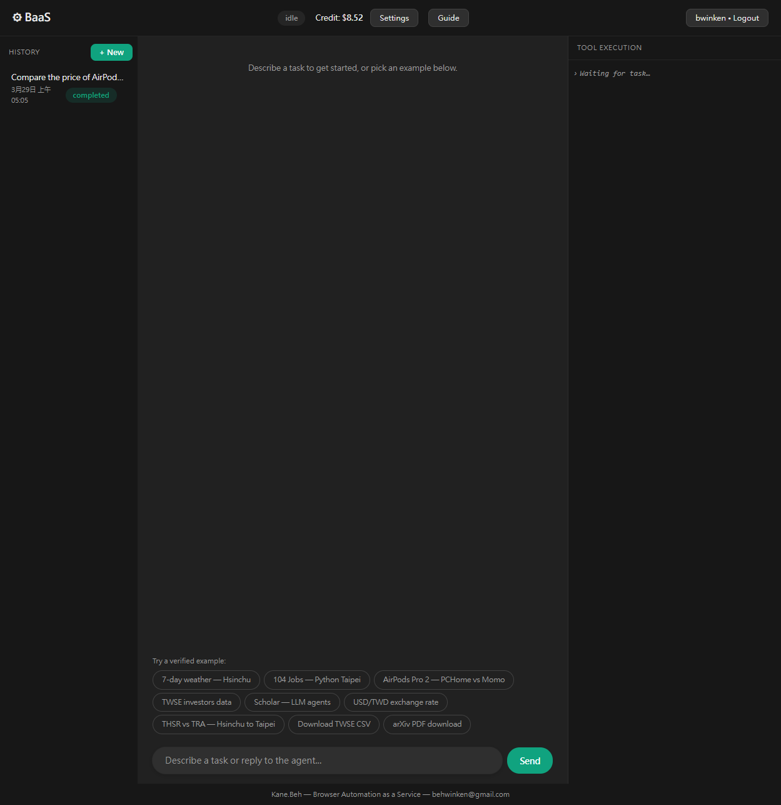
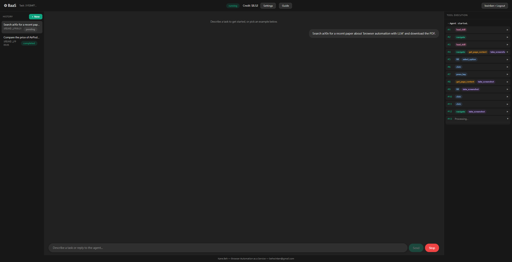
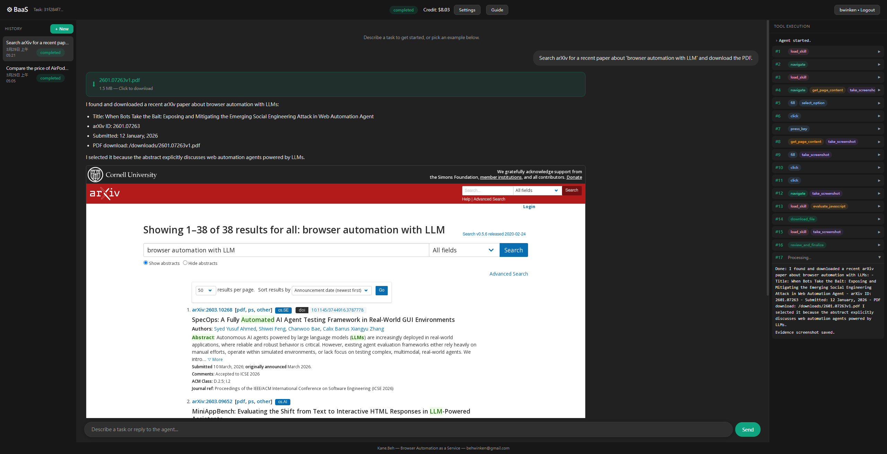
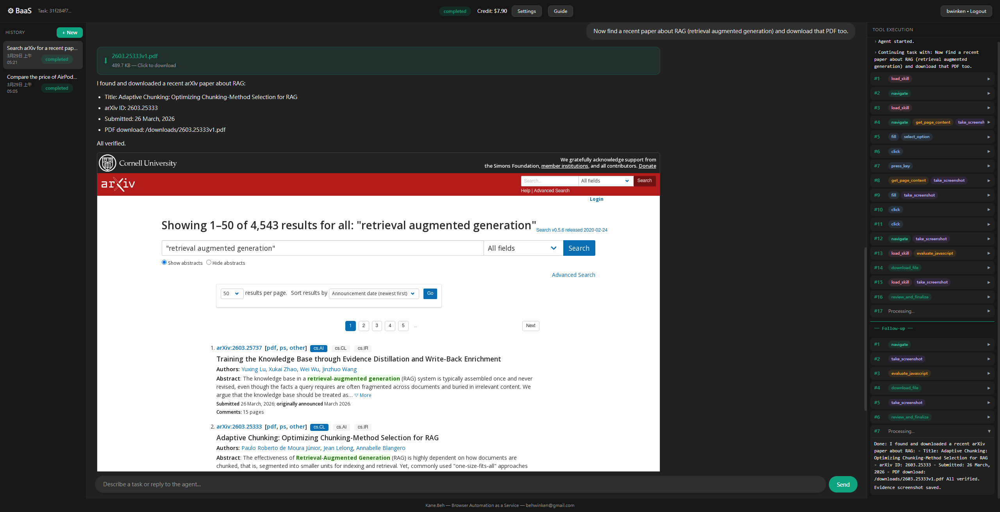
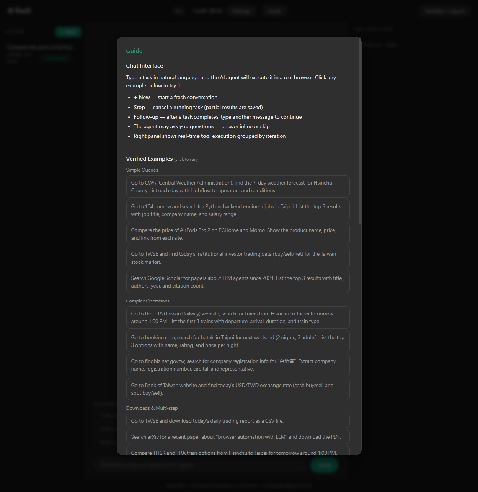

# BaaS — Operation Guide

> **Browser Automation as a Service**
> Live: [https://bwinken-baas.zeabur.app](https://bwinken-baas.zeabur.app)

---

## Quick Start

### 1. Login

Open the app URL. You will see the login page:



Use the credentials provided to you to login.

**First time?** Click "Register with invite code" to create your own account:



1. Enter the **invite code** provided to you (format: `BAAS-XXXX-XXXX`)
2. Choose a **username** (3-30 characters, alphanumeric)
3. Set a **password** (min 6 characters)
4. Click **Register** — you'll be logged in automatically

### 2. Main Interface

After login, you'll see the 3-panel interface:



| Panel | Description |
|-------|-------------|
| **Left — History** | Past tasks with status badges. Click to view. `+ New` starts a fresh task. |
| **Center — Chat** | Type a task in natural language, or click a verified example. |
| **Right — Tool Execution** | Real-time agent activity grouped by iteration. |

### 3. Run a Task

**Option A: Type your own task**
Type any browser automation task in natural language:
```
Search Google Scholar for papers about LLM agents since 2024.
List the top 3 results with title, authors, year, and citation count.
```

**Option B: Click a verified example**
At the bottom of the chat, you'll see pre-tested examples. Click one to run it immediately.

### 4. Watch the Agent Work

Once submitted, the Tool Execution panel shows real-time progress:



- Status badge changes to `running`, a red **Stop** button appears
- Each iteration shows colored tool tags: `navigate`, `click`, `evaluate_javascript`, etc.
- Click any iteration row to expand/collapse details

### 5. View Results

When complete, the result appears in the chat:



- **Download links** appear as green buttons at the top (click to download)
- **Markdown-formatted summary** with structured data
- **Evidence screenshots** from the browser (click to enlarge)

### 6. Follow-up Questions

Type another message to continue in the same task:



- The agent resumes with full conversation context
- Previous results and downloads are preserved
- The Tool Execution panel shows a `── Follow-up ──` separator between rounds

---

## Features

### Guide
Click the **Guide** button in the header to see:
- Usage instructions
- All verified example tasks (click to run)
- REST API documentation with curl examples
- WebSocket real-time protocol
- Quota information



### Settings
Click **Settings** to:
- View your **API key** (for programmatic access)
- Check your **usage** (spent / remaining credit)
- Add your own **OpenAI API key** (when free credit runs out)

### Task Management
- **+ New** — start a fresh conversation
- **Stop** — cancel a running task (generates partial summary)
- **Delete** — hover over a task in history, click `×`
- **Pagination** — navigate pages at the bottom of history

---

## REST API

All endpoints require `Authorization: Bearer YOUR_API_KEY` header.
Find your API key in **Settings** (click the eye icon to reveal, copy icon to copy).

### Step 1: Get Your API Key

Login to get your API key:
```bash
curl -X POST https://bwinken-baas.zeabur.app/api/users/login \
  -H "Content-Type: application/json" \
  -d '{"username": "YOUR_USERNAME", "password": "YOUR_PASSWORD"}'
```
Response:
```json
{"username": "your_user", "api_key": "xxxxxxxx-xxxx-xxxx-xxxx-xxxxxxxxxxxx"}
```

Save this `api_key` — use it as your Bearer token for all subsequent requests.

> You can also find your API key in the web UI: **Settings** → click the 👁 icon to reveal → click 📋 to copy.

### Step 2: Create a Task

```bash
curl -X POST https://bwinken-baas.zeabur.app/api/task \
  -H "Content-Type: application/json" \
  -H "Authorization: Bearer YOUR_API_KEY" \
  -d '{"prompt": "Search Google Scholar for papers about LLM agents since 2024. List top 3 with title and citations."}'
```
Response:
```json
{"task_id": "a1b2c3d4-5678-90ab-cdef-1234567890ab"}
```

### Step 3: Poll for Results

The task runs asynchronously. Poll until `status` is `completed`:
```bash
curl https://bwinken-baas.zeabur.app/api/task/TASK_ID \
  -H "Authorization: Bearer YOUR_API_KEY"
```
Response:
```json
{
  "task_id": "a1b2c3d4-...",
  "prompt": "Search Google Scholar...",
  "status": "completed",
  "result_data": {
    "summary": "Top 3 papers about LLM agents:\n\n1. ...",
    "complete": true,
    "screenshots": ["base64..."],
    "downloads": [{"filename": "paper.pdf", "size": "1.2 MB", "url": "/downloads/paper.pdf"}]
  },
  "chat_messages": [],
  "created_at": "2026-03-29T05:21:00"
}
```

### Step 4: Continue with Follow-up

After a task completes, send a follow-up message:
```bash
curl -X POST https://bwinken-baas.zeabur.app/api/task/TASK_ID/continue \
  -H "Content-Type: application/json" \
  -H "Authorization: Bearer YOUR_API_KEY" \
  -d '{"message": "Now search for RAG papers and download a PDF"}'
```

### Other Endpoints

**Cancel a running task:**
```bash
curl -X POST https://bwinken-baas.zeabur.app/api/task/TASK_ID/cancel \
  -H "Authorization: Bearer YOUR_API_KEY"
```

**List all tasks (paginated):**
```bash
curl "https://bwinken-baas.zeabur.app/api/task?skip=0&limit=10" \
  -H "Authorization: Bearer YOUR_API_KEY"
```

**Delete a task:**
```bash
curl -X DELETE https://bwinken-baas.zeabur.app/api/task/TASK_ID \
  -H "Authorization: Bearer YOUR_API_KEY"
```

**Check quota:**
```bash
curl https://bwinken-baas.zeabur.app/api/users/me \
  -H "Authorization: Bearer YOUR_API_KEY"
```
Response:
```json
{"username": "your_user", "quota_usd": 10.0, "spent_usd": 2.1, "remaining_usd": 7.9, "has_custom_key": false}
```

### WebSocket (Real-time Updates)

Connect to stream logs while a task is running:
```
wss://bwinken-baas.zeabur.app/ws/task/TASK_ID?token=YOUR_API_KEY
```
Messages from server:
```json
{"type": "log", "message": "[iter 1] Calling LLM...", "status": "running"}
{"type": "status", "status": "completed", "logs": [...]}
{"type": "ask_user", "question": "Which hotel?", "mode": "single_select", "options": ["A", "B"]}
```
Send to server:
```json
{"type": "hitl_response", "response": "A"}
{"type": "cancel"}
```

### Python Example

```python
import httpx
import time

BASE = "https://bwinken-baas.zeabur.app"
API_KEY = "YOUR_API_KEY"
headers = {"Authorization": f"Bearer {API_KEY}"}

# Create task
r = httpx.post(f"{BASE}/api/task",
    json={"prompt": "Find USD/TWD exchange rate from Bank of Taiwan"},
    headers={**headers, "Content-Type": "application/json"})
task_id = r.json()["task_id"]
print(f"Task: {task_id}")

# Poll until done
while True:
    r = httpx.get(f"{BASE}/api/task/{task_id}", headers=headers)
    data = r.json()
    if data["status"] in ("completed", "failed"):
        print(f"Status: {data['status']}")
        print(f"Result: {data['result_data']['summary']}")
        break
    time.sleep(5)
```

---

## What the Agent Can Do

### Simple Queries
- Weather forecasts (CWA)
- Job search (104.com.tw)
- Price comparison (PCHome, Momo)
- Stock market data (TWSE)
- Academic papers (Google Scholar)
- Exchange rates (Bank of Taiwan)

### Complex Operations
- Train schedules (TRA, THSR) with form filling
- Hotel search (Booking.com)
- Company registration lookup (findbiz.nat.gov.tw)
- Multi-site data comparison

### Downloads
- CSV/PDF file downloads from any website
- arXiv paper downloads
- TWSE trading reports

### Self-Healing
- Auto-dismisses cookie banners and popups
- Falls back between CSS/text/role selectors
- Detects and breaks out of loops
- Handles CAPTCHAs (image recognition + 2Captcha)
- Generates partial summary on timeout/cancel

---

## Quota

Each account gets **$10.00 USD** in free credit. Usage is calculated per LLM call based on token consumption (input + output).

When your credit runs out, you can add your own OpenAI API key in **Settings** to continue using the service with no quota limit.

---

## Technical Stack

| Component | Technology |
|-----------|-----------|
| Backend | Python 3.11, FastAPI |
| Browser | Playwright (headless Chromium) |
| AI Model | OpenAI GPT-5.4 (configurable) |
| Database | MongoDB (Beanie ODM) |
| Auth | Invite code + API key |
| Deployment | Docker on Zeabur |

---

*Built by Kane Beh — behwinken@gmail.com*
