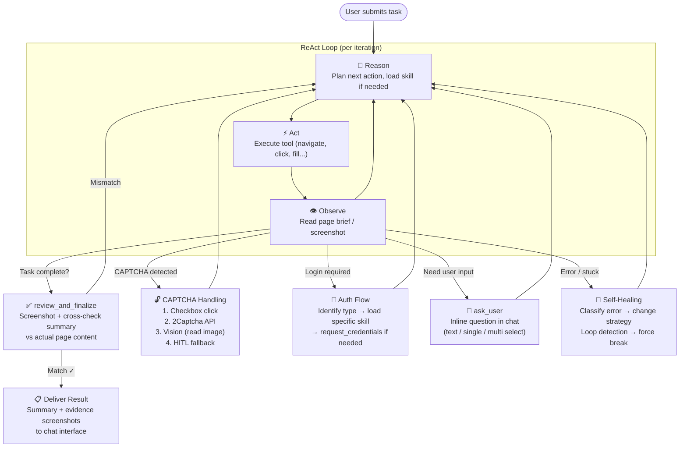
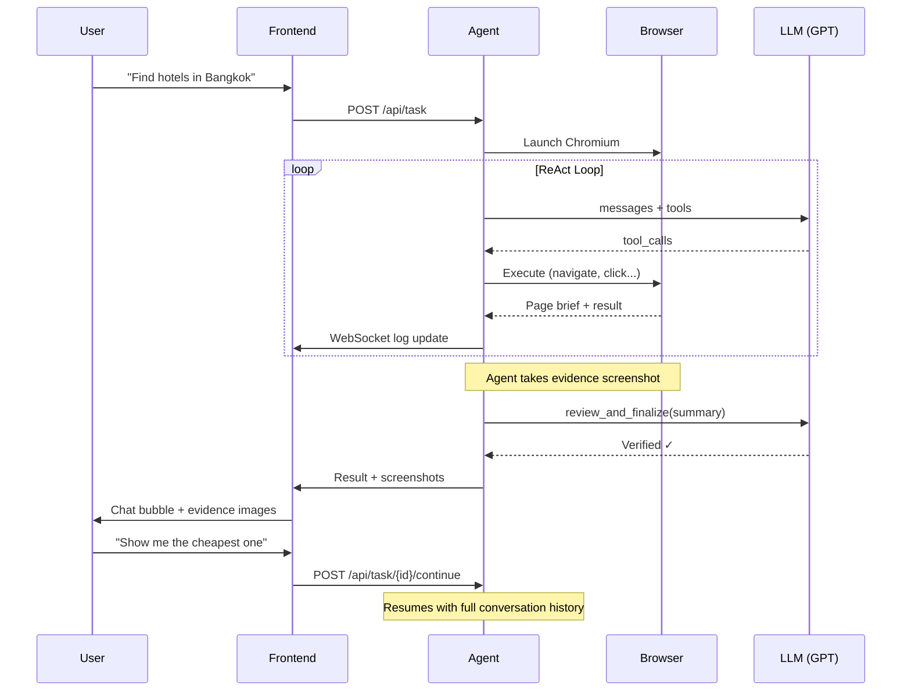

# Browser Automation as a Service (BaaS)

A natural-language browser automation platform. Submit a task in plain English or Chinese — an AI agent executes it step-by-step in a real Chromium browser with vision, self-healing, and human-in-the-loop support.

**No LangChain. No browser-use. No abstractions.**

---

## How the Agent Works

```mermaid
flowchart LR
    subgraph Tools["17 Browser Tools"]
        direction TB
        Nav["navigate\nclick · click_position\nfill · press_key\nselect_option · scroll"]
        Read["get_page_content\ntake_screenshot\nevaluate_javascript\nwait_for_element"]
        File["download_file\nsolve_captcha"]
        Human["ask_user\nrequest_credentials\nrequest_human_assistance"]
        Meta["load_skill\nreview_and_finalize"]
    end

    subgraph Skills["27 Skills (loaded on-demand)"]
        direction TB
        S1["🌐 Web: Cookie, Popup\nAutocomplete, Filtering"]
        S2["🔐 Auth: 8 login flows\nOAuth, SSO, 2FA, OTP"]
        S3["🔓 CAPTCHA: Auto-solve\nImage vision, 2Captcha"]
        S4["📅 Domain: Date Picker\nTravel, Transport, Forms"]
        S5["🔧 Recovery: Self-Heal\nEvidence, Error Recovery"]
    end

    Tools --> Skills
```







---

## Features

### Core
- **Natural language tasks** → AI agent plans and executes in a real browser
- **Pure OpenAI SDK** tool-calling loop (Chat Completions API)
- **Vision** — agent can see screenshots (GPT-4o vision) for CAPTCHA reading, coordinate clicking, and result verification
- **17 browser tools** — navigate, click, fill, scroll, press_key, screenshot, download, and more
- **Progressive skill loading** — 27 skill playbooks loaded on-demand (not all in system prompt)

### Intelligence
- **ReAct loop** — Reason → Act → Observe on every step
- **Self-healing** — auto-retry with selector fallbacks (CSS → text → role), error classification
- **Loop detection** — detects repeated failing actions and forces strategy change
- **Auto-dismiss overlays** — cookie banners, popups, login promos dismissed automatically (multilingual)
- **Evidence verification** — `review_and_finalize` tool cross-checks summary against actual page before delivering results

### Interaction
- **Chat interface** — conversational UI with tool execution panel
- **Task continuation** — follow-up messages resume with full conversation history
- **ask_user** — agent asks clarifying questions inline (single-select, multi-select, free-text)
- **request_credentials** — structured credential forms for login flows
- **Human-in-the-Loop (HITL)** — agent pauses on unsolvable problems, sends screenshot to operator

### Reliability
- **CAPTCHA handling** — multi-strategy: checkbox click → 2Captcha API → image vision → HITL fallback
- **Stealth mode** — `playwright-stealth` + randomized UA/viewport/timezone/delays
- **Human-like interactions** — press-and-hold with mouse curve simulation, random delays between actions
- **Smart timeouts** — page stabilization, network idle detection, LLM API timeout protection
- **WebSocket auto-reconnect** — frontend recovers from connection drops

---

## Tech Stack

| Layer | Technology |
|---|---|
| Backend | Python 3.11+, FastAPI |
| Database | MongoDB + Beanie (async ODM) |
| AI | OpenAI Python SDK, Chat Completions API with vision |
| Browser | Playwright (async), playwright-stealth |
| CAPTCHA | 2Captcha API (optional) |
| Frontend | Vanilla HTML + CSS + JS (chat interface) |
| Deploy | Docker → Zeabur |

---

## Quick Start

### Prerequisites
- Python 3.11+
- MongoDB Atlas account (free tier works)
- OpenAI API key
- 2Captcha API key (optional, for auto CAPTCHA solving)

### Setup

```bash
git clone https://github.com/bwinken/browser-automation-agent.git
cd browser-automation-agent

python -m venv .venv
.venv/Scripts/activate   # Windows
# source .venv/bin/activate  # macOS/Linux

pip install -r requirements.txt
playwright install chromium

cp .env.example .env
# Edit .env — fill in MONGODB_URL, OPENAI_API_KEY
```

### Run

```bash
python run.py
```

Open [http://localhost:8080](http://localhost:8080)

> **Windows note:** `run.py` sets `WindowsProactorEventLoopPolicy` before uvicorn starts — required for Playwright subprocess support.

### Environment Variables

| Variable | Description | Default |
|---|---|---|
| `MONGODB_URL` | MongoDB Atlas connection string | `mongodb://localhost:27017` |
| `DB_NAME` | Database name | `baas` |
| `OPENAI_API_KEY` | OpenAI API key | — |
| `OPENAI_MODEL` | Model to use | `gpt-4o` |
| `DEMO_API_KEY` | Pre-created user UUID for dev | — |
| `TWOCAPTCHA_API_KEY` | 2Captcha API key for auto CAPTCHA solving | — |
| `DOWNLOAD_DIR` | Directory for downloaded files | `downloads` |
| `HEADLESS` | Run browser headlessly | `true` |
| `DEV_MODE` | Skip auth, use first user | `false` |
| `LOG_LEVEL` | `DEBUG` / `INFO` / `WARNING` | `INFO` |
| `MAX_CONCURRENT_BROWSERS` | Simultaneous Playwright instances | `2` |
| `MAX_AGENT_ITERATIONS` | Max LLM loop iterations per task | `20` |

---

## API

### Authentication
All task endpoints require `Authorization: Bearer <api_key>` header.
In `DEV_MODE=true`, auth is bypassed (uses first user in DB).

### Endpoints

```
POST /api/users/register          — Create account → returns api_key
POST /api/users/login             — Login → returns api_key

POST /api/task                    — Submit task (202 + task_id)
POST /api/task/{task_id}/continue — Continue task with follow-up message
GET  /api/task/{task_id}          — Poll task status + logs + result
GET  /api/task                    — List tasks (paginated, newest first)

WS   /ws/task/{task_id}           — Live log stream + HITL + ask_user channel
```

### Task Lifecycle

```
pending → running → completed
                 → paused (HITL/ask_user) → running → completed
                 → failed
completed → running (via /continue) → completed
```

---

## Agent Tools (17)

| Tool | Description |
|---|---|
| `navigate(url)` | Navigate to URL, auto-dismisses overlays |
| `click(selector, hold_ms?)` | Click element with fallbacks; optional press-and-hold |
| `click_position(x, y)` | Click at exact pixel coordinates |
| `fill(selector, text)` | Type into input, auto-handles autocomplete dropdowns |
| `press_key(key, selector?)` | Keyboard input with alias auto-fix (Ctrl→Control) |
| `select_option(selector, value)` | Select from `<select>` dropdown |
| `scroll(direction, amount?)` | Scroll page up/down |
| `wait_for_element(selector, timeout?)` | Wait for dynamic element to appear |
| `get_page_content()` | LLM-friendly DOM snapshot (80 elements) |
| `take_screenshot()` | Screenshot visible to LLM via vision |
| `evaluate_javascript(script)` | Execute JS in browser (advanced fallback) |
| `download_file(url?, selector?)` | Download file by URL or click trigger |
| `load_skill(name)` | Load a skill playbook on demand |
| `solve_captcha()` | Multi-strategy CAPTCHA solver |
| `review_and_finalize(summary)` | Cross-check summary against page before delivery |
| `ask_user(question, mode?, options?)` | Ask user inline (text/single/multi select) |
| `request_credentials(reason, fields)` | Structured credential form |
| `request_human_assistance(reason)` | Emergency escalation with screenshot |

---

## Skills (27)

Skills are loaded on-demand via `load_skill()` — only the catalogue (names + triggers) is in the system prompt.

| Category | Skills |
|---|---|
| **Web Interaction** | Cookie Consent, Popup Dismissal, Autocomplete Handling, Search Results Filtering |
| **Authentication** | Identify Login Type, Standard Form, Multi-Step, OAuth, SSO, Magic Link, Phone OTP, Two-Factor/MFA |
| **CAPTCHA** | CAPTCHA Handling, Image CAPTCHA / Verification Code |
| **Navigation** | Search Pattern, Infinite Scroll, Navigation Error Recovery, Multi-Page Navigation, Avoid Blocked Services |
| **Data** | Date Picker Handling, Data Extraction, Evidence Collection |
| **Domain** | Travel / Hotel Booking, Transportation / Ticket Booking, Complex Web App, Form Filling, File Download |
| **Recovery** | Self-Healing / Error Recovery |

---

## Frontend

Chat-based interface with three panels:

```
┌──────────┬───────────────────────────────┬──────────────────┐
│ History  │          Chat                 │ Tool Execution   │
│          │                               │                  │
│ ▪ task1  │  User: Search hotels...       │ › navigate(...)  │
│ ▪ task2  │  Agent: Found 3 hotels...     │ › click(...)     │
│ ▪ task3  │  [screenshot evidence]        │ › [SKILL: ...]   │
│          │                               │ › get_page_...   │
│          │  Agent asks: Which one?       │                  │
│          │  [Option A] [Option B]        │                  │
├──────────┴───────────────────────────────┴──────────────────┤
│  [Type a task or reply...]                        [Send]    │
└─────────────────────────────────────────────────────────────┘
```

---

## Deployment (Zeabur)

1. Push to GitHub
2. Zeabur → New Project → Add Service → **Git** (select this repo)
3. Add Service → **MongoDB** from Marketplace (or use Atlas connection string)
4. Set environment variables in Zeabur Variables panel
5. Deploy — Zeabur builds from `Dockerfile` automatically

---

## Project Structure

```
app/
├── main.py           FastAPI app, lifespan, routes
├── config.py         pydantic-settings
├── models.py         Beanie: User, Task
├── auth.py           bcrypt hashing, HTTPBearer guard
├── shared.py         In-process HITL state (Events/Queues)
├── tools.py          17 tool schemas + PlaywrightToolExecutor
├── agent.py          AgentRunner — ReAct loop with vision
├── skills.py         27 progressive skill playbooks
├── captcha.py        Multi-strategy CAPTCHA solver
├── logging_config.py
├── api/
│   ├── users.py      Register / login
│   └── tasks.py      Submit / poll / continue tasks
└── ws/
    └── hitl.py       WebSocket log stream + HITL + ask_user
static/
└── index.html        Chat interface + tool panel
run.py                Entry point (Windows event loop policy)
Dockerfile
```
